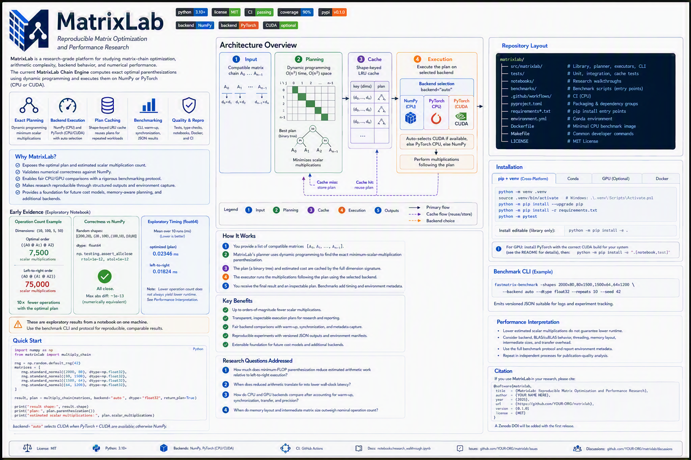

# MatrixLab

> **Reproducible Matrix Optimization and Performance Research**

MatrixLab is a research-grade platform for studying matrix-chain optimization, arithmetic complexity, backend behavior, and numerical performance. Its first implementation, the **MatrixLab Chain Engine**, computes exact minimum-scalar-multiplication plans and executes those plans with NumPy or optional PyTorch CPU/CUDA backends.

<!-- TODO: Replace OWNER/REPOSITORY and workflow names before publishing. -->
[](https://github.com/OWNER/REPOSITORY/actions/workflows/ci.yml)
[](https://www.python.org/)
[](LICENSE)
[](https://numpy.org/)
[](https://pytorch.org/)
[](https://developer.nvidia.com/cuda-zone)

[Quick Start](#quick-start) · [Architecture](#architecture) · [Results](#preliminary-results) · [Benchmarking](#benchmarking) · [Reproducibility](#correctness-and-numerical-reproducibility) · [Roadmap](#research-extension-roadmap)

<!--
DIAGRAM PLACEHOLDER

Save the updated diagram as:
  docs/assets/matrixlab-architecture.png

Then remove the surrounding comment markers from the image block below.
-->

<!--
<p align="center">
  
</p>
-->

> **Research scope:** MatrixLab currently optimizes the order of compatible chains of conventional dense, two-dimensional matrix multiplications. The Chain Engine does **not** claim a novel asymptotic multiplication algorithm. Its current planner minimizes estimated scalar multiplication count, not measured latency, peak memory, energy use, or numerical error.



## Platform Model

```text
MatrixLab
├── Chain Engine                   # Current implementation
│   ├── Dynamic-programming planner
│   ├── Inspectable execution plan
│   ├── Shape-keyed LRU plan cache
│   └── NumPy and PyTorch executors
├── Benchmark Framework            # Current implementation
├── Research Notebook              # Current implementation
├── Reproducibility Tooling        # Current implementation
└── Future Research Engines
    ├── Memory-aware planning
    ├── Hardware-calibrated costs
    ├── Sparse and structured strategies
    └── Additional array backends
```

The broader MatrixLab identity creates room for future research engines without overstating the capabilities implemented today.

## Rebrand and Namespace Migration

| Element | Previous identity | MatrixLab target |
|---|---|---|
| Project | FastMatrix Chain | MatrixLab |
| Current component | Matrix-chain toolkit | MatrixLab Chain Engine |
| Python package | `fastmatrix` | `matrixlab` |
| Benchmark CLI | `fastmatrix-benchmark` | `matrixlab-benchmark` |
| Conda/Jupyter environment | `fastmatrix-chain` | `matrixlab` |
| Docker image | `fastmatrix-chain:<version>` | `matrixlab:<version>` |

> **Migration control:** The examples below use the target `matrixlab` namespace. Do not publish a release under the new namespace until the source tree, package metadata, entry points, tests, notebooks, Docker image, and CI workflows pass end to end. If compatibility is required, provide a temporary `fastmatrix` import shim with a documented removal version.

## Why MatrixLab?

NumPy's `multi_dot` already provides optimized parenthesization. MatrixLab is intended for work that also requires:

- Explicit and inspectable execution plans
- Estimated scalar multiplication counts
- Shape-aware plan reuse
- Controlled backend and device selection
- CPU/CUDA comparison protocols
- Versioned machine-readable benchmark output
- Environment and source-revision capture
- Numerical validation with declared tolerances
- Clear separation between mathematical optimization and observed runtime

## Current Capabilities

- Exact dynamic-programming matrix-chain planning
- Classical minimum-scalar-multiplication objective
- Human-readable parenthesization and operation-count metadata
- Shape-keyed LRU plan caching
- NumPy CPU execution
- Optional PyTorch CPU and CUDA execution
- Automatic backend selection
- Benchmark CLI with warm-up and GPU synchronization
- Versioned JSON benchmark output
- Notebook-based research walkthrough
- Tests, type checking, linting, coverage, Docker, and CPU CI

## Architecture

```text
Compatible Dense Matrix Chain
            |
            v
Input Validation and Dimension Extraction
            |
            v
Shape-Keyed Plan Lookup
       +----+----+
       |         |
   Cache Hit  Cache Miss
       |         |
       |         v
       |   Exact Dynamic-Programming Planner
       |   Time O(n^3), Space O(n^2)
       |         |
       |         v
       |   Store Inspectable Binary Plan
       +----+----+
            |
            v
Backend Selection and Normalization
  +---------+----------+-----------+
  |                    |           |
NumPy CPU          PyTorch CPU  PyTorch CUDA
  |                    |           |
  +---------+----------+-----------+
            |
            v
Plan-Ordered Numerical Execution
            |
            v
Result Matrix + Optional Plan Metadata
            |
            v
Benchmark JSON + Environment Evidence
            |
            v
Tests, Notebook, Docker, and CI
```

## Research Questions

1. How much does minimum-FLOP parenthesization reduce estimated arithmetic work relative to left-to-right execution?
2. When does reduced arithmetic translate into lower wall-clock latency?
3. How do CPU and GPU backends compare after accounting for warm-up, synchronization, transfer, and precision?
4. When do memory layout and intermediate matrix size outweigh nominal operation count?

## Preliminary Results

> **Evidence status:** Exploratory notebook results from one environment. These observations demonstrate behavior and inform future experiments. They are not generalized performance claims.

<!--
RESULTS TOPBOX PLACEHOLDER

Save a composite summary image as:
  docs/assets/matrixlab-results-topbox.png

Then remove the surrounding comment markers below.
-->

<!--
<p align="center">
  
</p>
-->

### Results at a Glance

- **Operation count:** For dimensions `(10, 100, 5, 50)`, MatrixLab selects `((A0 @ A1) @ A2)` with `7,500` estimated scalar multiplications versus `75,000` for `A0 @ (A1 @ A2)`. This is a `10x` reduction in estimated arithmetic work for the example.
- **Correctness:** The demonstrated `float64` result matches `numpy.linalg.multi_dot` under `numpy.testing.assert_allclose` with `rtol=1e-12` and `atol=1e-12`.
- **Timing:** In the displayed ten-repeat microbenchmark, the optimized path had a mean of `0.023460 ms` and median of `0.018600 ms`; left-to-right execution had a mean of `0.018240 ms` and median of `0.017000 ms`.
- **Interpretation:** The optimized plan reduced the arithmetic cost but did not reduce latency in this small exploratory workload. Framework overhead, allocation, memory behavior, kernel dispatch, timer resolution, and system noise can outweigh arithmetic savings at this scale.

### Known Operation-Count Example

| Parenthesization | Cost calculation | Estimated scalar multiplications |
|---|---:|---:|
| `(A0 @ A1) @ A2` | `(10*100*5) + (10*5*50)` | `7,500` |
| `A0 @ (A1 @ A2)` | `(100*5*50) + (10*100*50)` | `75,000` |

The example establishes exact optimization under the classical scalar-count model. It does not imply a universal `10x` wall-clock improvement.

### Exploratory Timing Summary

| Statistic | Optimized plan (ms) | Left-to-right (ms) |
|---|---:|---:|
| Count | 10 | 10 |
| Mean | 0.023460 | 0.018240 |
| Standard deviation | 0.009625 | 0.002510 |
| Minimum | 0.015400 | 0.016700 |
| 25th percentile | 0.016600 | 0.016825 |
| Median | 0.018600 | 0.017000 |
| 75th percentile | 0.028825 | 0.018150 |
| Maximum | 0.042600 | 0.023600 |

The visible notebook environment included Windows 11, Python 3.12.10, NumPy 2.3.3, and an AMD64 architecture. Publication-quality analysis requires additional shapes, multiple independent processes, captured BLAS configuration, controlled power conditions, and explicit cache-state reporting.

## Quick Start

```python
import numpy as np
from matrixlab import multiply_chain

rng = np.random.default_rng(42)
matrices = [
    rng.standard_normal((2000, 80), dtype=np.float32),
    rng.standard_normal((80, 1500), dtype=np.float32),
    rng.standard_normal((1500, 64), dtype=np.float32),
    rng.standard_normal((64, 1200), dtype=np.float32),
]

result, plan = multiply_chain(
    matrices,
    backend="auto",
    dtype="float32",
    return_plan=True,
)

print(result.shape)
print(plan.parenthesization())
print(plan.scalar_multiplications)
```

## Design

Given matrices `A0...An-1` with dimensions `p0 x p1`, `p1 x p2`, ..., `pn-1 x pn`, the planner evaluates every binary split:

```text
cost[i,j] = min(cost[i,k] + cost[k+1,j] + p[i] * p[k+1] * p[j+1])
```

Planning uses `O(n^3)` time and `O(n^2)` space for `n` matrices. Execution uses the resulting binary tree and delegates each `@` operation to the selected array backend.

NumPy's `multi_dot` is the primary CPU reference because its documentation states that it uses optimal parenthesization. This project implements an explicit, inspectable plan so experiments can report order and estimated scalar multiplications.

## Repository Layout

```text
.
├── src/matrixlab/          # Installable library and benchmark CLI
├── tests/                   # Correctness, validation, and cache tests
├── notebooks/               # Executable research walkthrough
├── benchmarks/              # Script entry point
├── .github/workflows/       # CPU CI
├── pyproject.toml           # Package metadata and dependency groups
├── requirements*.txt        # pip installation entry points
├── environment.yml          # conda environment
├── Dockerfile               # Minimal CPU benchmark image
├── Makefile                 # Common development commands
└── LICENSE                  # MIT license
```

## Prerequisites

- Python 3.10 or newer
- A C/C++ runtime compatible with the installed numerical wheels
- Optional: NVIDIA GPU, compatible driver, and a suitable PyTorch build for CUDA execution

## Traditional Setup with `venv`

### Windows PowerShell

```powershell
py -3.12 -m venv .venv
.\.venv\Scripts\Activate.ps1
python -m pip install --upgrade pip
python -m pip install -r requirements.txt
python -m pytest
```

### Linux or macOS

```bash
python3 -m venv .venv
source .venv/bin/activate
python -m pip install --upgrade pip
python -m pip install -r requirements.txt
python -m pytest
```

The base library alone can be installed with:

```bash
python -m pip install -e .
```

## Conda Setup

```bash
conda env create -f environment.yml
conda activate matrixlab
python -m pytest
```

## JupyterLab

After installing `requirements.txt` or creating the conda environment:

```bash
python -m ipykernel install --user --name matrixlab --display-name "Python (MatrixLab)"
python -m jupyter lab
```

Open `notebooks/research_walkthrough.ipynb` and select **Python (MatrixLab)** if the environment is not selected automatically.

## Optional GPU Setup

The convenience dependency is:

```bash
python -m pip install -r requirements-gpu.txt
```

PyTorch installation varies by operating system and accelerator. For controlled research environments, install the build appropriate to the team's hardware using official PyTorch guidance, then install this project without replacing that build:

```bash
python -m pip install -e ".[notebook,test]"
python -c "import torch; print(torch.__version__, torch.cuda.is_available())"
```

Do not interpret GPU results unless the report confirms a `torch:cuda` backend. GPU timings must synchronize before stopping the timer; the included benchmark does this.

## Library Usage

```python
import numpy as np
from matrixlab import multiply_chain

rng = np.random.default_rng(42)
matrices = [
    rng.standard_normal((2000, 80), dtype=np.float32),
    rng.standard_normal((80, 1500), dtype=np.float32),
    rng.standard_normal((1500, 64), dtype=np.float32),
    rng.standard_normal((64, 1200), dtype=np.float32),
]

result, plan = multiply_chain(
    matrices,
    backend="auto",
    dtype="float32",
    return_plan=True,
)

print(result.shape)
print(plan.parenthesization())
print(plan.scalar_multiplications)
```

Backend behavior:

- `numpy`: always returns a NumPy array.
- `torch`: returns a PyTorch tensor on the requested or automatically selected device.
- `auto`: selects CUDA when PyTorch is installed and CUDA is available; otherwise NumPy.

For a single input matrix, the function returns a numerically equivalent backend array after dtype and device normalization.

## Benchmarking

Run the packaged CLI:

```bash
matrixlab-benchmark \
  --shapes 2000x80,80x1500,1500x64,64x1200 \
  --backend numpy \
  --dtype float32 \
  --repeats 10 \
  --seed 42
```

Or run the module directly:

```bash
python -m matrixlab.benchmark --backend auto
```

The command emits versioned JSON suitable for logs and experiment tracking. Record the output with environment metadata:

```bash
mkdir -p benchmark-results
python -m matrixlab.benchmark > benchmark-results/run.json
python -m pip freeze > benchmark-results/packages.txt
python -c "import numpy as np; np.show_config()" > benchmark-results/numpy-config.txt
```

### Benchmark Protocol

- Use fixed shapes, dtype, seed, and repeat count.
- Run one unmeasured warm-up iteration.
- Synchronize asynchronous GPU execution.
- Report minimum, median, and maximum time.
- Record CPU, GPU, RAM, operating system, Python version, package versions, and NumPy build configuration.
- Separate host-to-device transfer measurement from compute-only experiments when that distinction matters.
- Compare equivalent precision and numerical tolerances.
- Run multiple independent processes for publication-quality analysis.
- Avoid unrelated workloads and dynamic power-policy changes during measurement.

The CLI currently measures end-to-end calls, including backend normalization and any host-to-device conversion. For steady-state GPU studies, retain tensors on the GPU before timing and use the plan API to design a compute-only experiment.

## Correctness and Numerical Reproducibility

Matrix multiplication is associative in exact arithmetic, but floating-point evaluation order can change rounding. Therefore:

- Validate with `numpy.testing.assert_allclose`, not exact equality.
- Set tolerances according to dtype, scale, conditioning, and research requirements.
- Prefer `float64` for stricter numerical work when performance and memory permit.
- Report precision controls explicitly when using accelerator-specific modes.
- Do not treat matching shapes or lower latency as evidence of equivalent numerical quality.

Run quality checks:

```bash
python -m ruff check .
python -m pytest --cov=matrixlab --cov-report=term-missing
python -m mypy src
```

## Docker

Build and run the CPU benchmark image:

```bash
docker build -t matrixlab:0.1.0 .
docker run --rm matrixlab:0.1.0 --backend numpy --repeats 5
```

GPU container execution is intentionally not embedded because driver and CUDA compatibility are deployment-specific. Add a pinned accelerator base image only after validating the team's target platform.

## CI/CD

The included GitHub Actions workflow:

- Tests Python 3.10 and 3.12.
- Runs Ruff static checks.
- Executes the unit suite with coverage.
- Does not assert performance thresholds on shared CI runners because noisy infrastructure can create misleading regressions.

For dedicated benchmark hardware, add a separate scheduled pipeline that stores JSON artifacts and compares distributions against an approved baseline.

## Known Constraints

- Dense two-dimensional matrices only.
- No sparse matrix planner.
- No distributed or multi-GPU execution.
- The planner minimizes scalar multiplication count, not measured latency or peak intermediate memory.
- Host-to-device conversion can dominate small GPU workloads.
- Input mutation during execution is outside the supported contract.
- Extremely long chains use recursive execution and may require an iterative executor.

## Brand Architecture

- **Platform:** MatrixLab
- **Current engine:** MatrixLab Chain Engine
- **Python namespace:** `matrixlab`
- **Benchmark command:** `matrixlab-benchmark`
- **Tagline:** Reproducible Matrix Optimization and Performance Research
- **Repository image:** `docs/assets/matrixlab-architecture.png`
- **Results image:** `docs/assets/matrixlab-results-topbox.png`

Documentation must identify roadmap capabilities as future work and reserve current-tense claims for implemented, tested behavior.

## Research Extension Roadmap

- Add a Pareto planner balancing FLOPs, peak intermediate memory, and empirical kernel latency.
- Cache benchmark-calibrated costs by hardware, dtype, shape, and layout.
- Add JAX and CuPy adapters behind the same plan interface.
- Add sparse and structured matrix strategies.
- Add out-of-core execution with explicit memory budgets.
- Add property-based testing for randomized compatible shape chains.
- Export OpenTelemetry metrics for service deployment.

A future-state implementation could treat hardware calibration as an event-driven process. New benchmark results would update a versioned cost model, allowing subsequent executions to select plans using observed platform behavior rather than arithmetic count alone.

## Security and Governance

- The package requires no credentials or network access at runtime.
- Do not commit research datasets, proprietary matrices, secrets, or benchmark artifacts containing sensitive metadata.
- Review third-party dependencies through the team's software-composition-analysis process.
- Pin and approve versions for regulated or validated environments.
- Retain benchmark configuration and source revision with every reported result.

## Reproducibility Checklist

Before publishing benchmark findings, capture:

- [ ] Matrix shapes and generation method
- [ ] Random seed and dtype
- [ ] Requested and resolved backend
- [ ] Device, CPU, GPU, and RAM details
- [ ] Operating system and Python version
- [ ] NumPy configuration and dependency versions
- [ ] PyTorch, CUDA runtime, and driver versions when applicable
- [ ] Warm-up and synchronization policy
- [ ] Transfer-inclusive or compute-only scope
- [ ] Cold or warm plan-cache state
- [ ] Repeat count and independent-process count
- [ ] Raw observations and aggregation method
- [ ] Numerical tolerances and validation result
- [ ] Parenthesization and estimated operation count
- [ ] Git commit SHA and working-tree state

## References

- NumPy `multi_dot`: https://numpy.org/doc/stable/reference/generated/numpy.linalg.multi_dot.html
- PyTorch `matmul`: https://pytorch.org/docs/stable/generated/torch.matmul.html
- PyTorch CUDA semantics: https://pytorch.org/docs/stable/notes/cuda.html
- NVIDIA cuBLAS: https://docs.nvidia.com/cuda/cublas/index.html
- JupyterLab installation: https://jupyterlab.readthedocs.io/en/stable/getting_started/installation.html

## Citation

<!-- TODO: Replace author, repository URL, release version, year, and DOI. -->

```bibtex
@software{matrixlab_TODO_YEAR,
  author  = {TODO: Author Name},
  title   = {MatrixLab: Reproducible Matrix Optimization and Performance Research},
  year    = {TODO: Year},
  version = {TODO: Release Version},
  url     = {https://github.com/OWNER/REPOSITORY},
  license = {MIT},
  doi     = {TODO: DOI}
}
```

Archive a versioned release before citing MatrixLab in published research.

## License

MIT. See `LICENSE`.

## Contributing

1. Create a branch from the approved default branch.
2. Add or update tests with every behavior change.
3. Run lint, type checking, and tests locally.
4. Document benchmark methodology for performance claims.
5. Submit a pull request with scope, evidence, risks, and rollback considerations.
